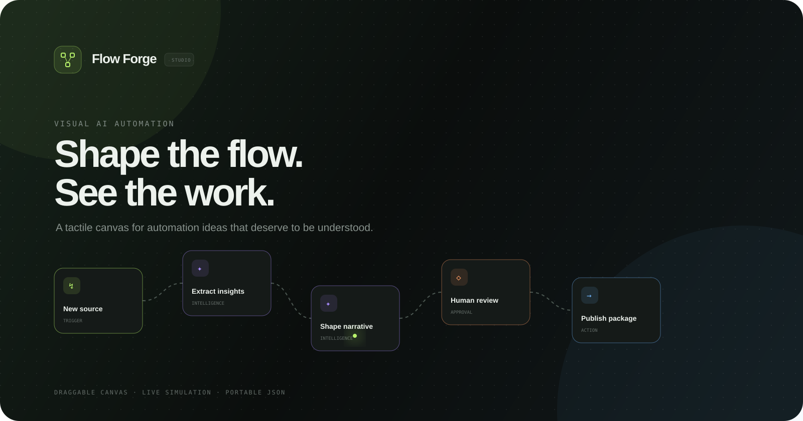
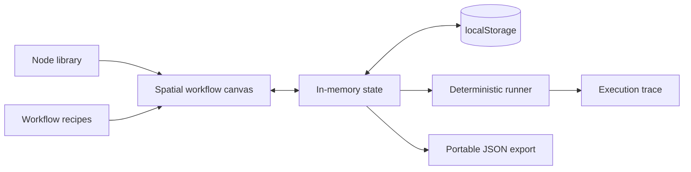

<div align="center">
  

  <br />

**A tactile, local-first canvas for designing and simulating AI automations.**

[](#quick-start)
[](app.js)
[](#privacy)
[](LICENSE)
</div>

## The idea

Most automation diagrams are either too abstract to operate or too configuration-heavy to understand. Flow Forge asks a simpler question: **what if the workflow itself were the primary interface?**

It is a browser-based studio where triggers, intelligence, decisions, approvals, and actions become a readable spatial system. You can add and drag nodes, edit their behavior, load recipes, replay execution, undo changes, and export the result.

> Flow Forge is an interactive product prototype. The execution engine and confidence values are deterministic simulations. No LLM, integration, or external automation service is contacted.

## What you can do

- Build from a categorized **node library** or load one of three workflow recipes.
- **Drag and arrange** connected nodes on a dotted spatial canvas.
- Edit labels, descriptions, processing depth, creativity, and test payloads.
- Watch a **step-by-step test run** with animated connectors and an execution trace.
- Duplicate, delete, zoom, fit, rename, and undo canvas changes.
- Persist the current workspace in `localStorage`.
- Export a portable, human-readable `.flow.json` definition.
- Navigate the core experience by keyboard with visible focus states.

## Architecture



```text
index.html          semantic studio, inspector, recipes
styles.css          visual system, canvas, responsive states
interactions.css    collapsible studio-layout overrides
app.js              state, dragging, rendering, runner, export
assets/cover.svg     repository hero artwork
```

## Quick start

```bash
git clone https://github.com/harshareddy0405/flow-forge.git
cd flow-forge
python3 -m http.server 8080
```

Open [http://localhost:8080](http://localhost:8080). There is no package install, build step, API key, or account.

## Product tour

1. Click a block in the left library to append it to the flow.
2. Drag any node to reshape the canvas; select it to open the inspector.
3. Change its label, processing mode, creativity, or test payload.
4. Select **Test run** or press <kbd>R</kbd> and follow the live trace.
5. Load a recipe to explore a different automation pattern.
6. Export the workflow and inspect the generated JSON.

Useful shortcuts:

| Shortcut                                    | Action                      |
| ------------------------------------------- | --------------------------- |
| <kbd>/</kbd>                                | Search the node library     |
| <kbd>R</kbd>                                | Run the current workflow    |
| <kbd>⌘</kbd>/<kbd>Ctrl</kbd> + <kbd>Z</kbd> | Undo the last canvas change |

## Workflow format

Exports are intentionally unsurprising:

```json
{
  "format": "flow-forge/v1",
  "title": "Signal-to-story engine",
  "nodes": [
    {
      "kind": "intelligence",
      "label": "Extract insights",
      "x": 265,
      "y": 65,
      "mode": "balanced",
      "temperature": 0.4
    }
  ]
}
```

## Privacy

The workflow, editor state, and run counter stay in your browser. Flow Forge sends no workflow data and collects no analytics. Clear the site’s browser storage to reset the canvas.

The presentation loads two Google Fonts. Self-host or replace those font declarations for a completely offline deployment.

## Roadmap

- [ ] User-drawn connections and branching paths
- [ ] JSON import with schema validation
- [ ] Retry, timeout, and failure-injection controls
- [ ] Reusable subflows and parameter contracts
- [ ] Pluggable execution adapters with explicit permissions
- [ ] Collaborative cursors and read-only share links

## Contributing

Contributions should preserve the zero-build, honest-simulation baseline. Please test dragging, keyboard navigation, narrow layouts, and reduced-motion mode before opening a pull request.

## License

[MIT](LICENSE) © 2026 Harshavardhan

---

<div align="center"><sub>Built to make automation logic legible, editable, and worth discussing.</sub></div>

## Built to be inspected

[](https://github.com/harshareddy0405/flow-forge/actions/workflows/ci.yml)

The project includes versioned source, guarded local persistence, malformed-data recovery, product-specific interaction tests, and automated accessibility semantics checks. No API key is required to explore it.

```bash
# Optional development checks; the app itself needs no installation
npm ci --ignore-scripts
npm run check
npm test
npm run format:check
```

[Engineering notes](docs/ENGINEERING.md) · [Contributing](CONTRIBUTING.md) · [Security & privacy](SECURITY.md)

**Scope:** Run order follows the node list. Logic approvals and external actions are simulated; no connector executes remotely.
